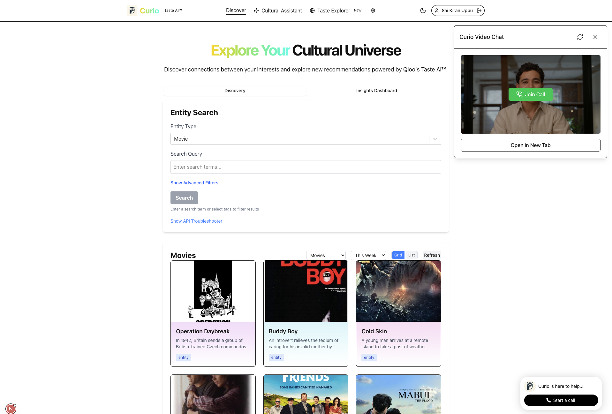
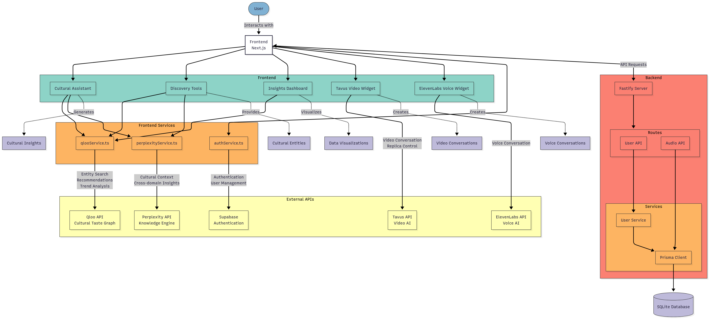

# Curio - Cultural Intelligence Assistant

<div align="center">
  
  <p><strong>Discover connections across music, film, dining, fashion, and more with Qloo's Taste AI™</strong></p>
</div>

## Inspiration

Our inspiration for Curio came from observing how traditional recommendation systems create "filter bubbles" that limit discovery rather than expanding horizons. We wanted to create an intelligent cultural assistant that could break down these silos and reveal meaningful connections across different domains of culture – from music and film to dining and fashion.

We were fascinated by how our cultural preferences are interconnected in ways we don't always recognize. The music you love might reveal something about the books you'd enjoy, or your favorite restaurants might connect to fashion trends you'd appreciate. By leveraging the power of AI, we aimed to make these hidden cultural connections visible and actionable.

## What it does

Curio is a comprehensive cultural intelligence platform that leverages multiple AI technologies to help users discover connections across various domains of culture and taste. By integrating Qloo's Taste AI™, Perplexity's knowledge engine, Tavus Video AI, and ElevenLabs voice technology, Curio provides personalized recommendations, trend analysis, and interactive assistance for exploring cultural connections.

Key features include:
- **Cultural Assistant**: An interactive AI that provides personalized recommendations and insights based on your cultural preferences
- **Entity Discovery**: Search and explore entities across movies, music, books, restaurants, and more
- **Cultural Compatibility Matcher**: Find friends, partners, or colleagues with complementary cultural tastes
- **Taste Profile Builder**: Create a comprehensive profile of your cultural preferences across domains
- **Interactive AI Interfaces**: Engage through text, voice (ElevenLabs), or video (Tavus) conversations
- **Trend Analysis**: Understand cultural trends, their significance, and how they connect to other domains

## How we built it

We built Curio as a modern full-stack application with a careful selection of technologies:

1. **Frontend**: We used Next.js 15 with React 19, leveraging server components for performance and Tailwind CSS for a sleek UI. Zustand manages state efficiently, while D3.js powers our data visualizations.

2. **Backend**: We implemented a Fastify backend with TypeScript, using Prisma ORM with SQLite for data persistence. The backend provides RESTful endpoints with JWT authentication.

3. **AI Integration**: 
   - Qloo's Taste AI™ provides the cultural graph and recommendation engine
   - Perplexity API delivers knowledge-rich contextual information
   - Tavus Video AI enables face-to-face video conversations with our cultural assistant
   - ElevenLabs Voice AI offers natural voice interaction

4. **Architecture**: We followed a modular component structure with service-oriented design patterns, allowing each AI service to be cleanly integrated while maintaining separation of concerns.

## Challenges we ran into

Building Curio presented several significant challenges:

1. **API Integration Complexity**: Harmonizing four different AI APIs (Qloo, Perplexity, Tavus, and ElevenLabs) into a cohesive experience required careful planning and robust error handling.

2. **Cross-Domain Intelligence**: Creating meaningful connections across disparate cultural domains was technically challenging. We had to design systems that could effectively interpret and relate entities from completely different categories.

3. **User Experience Design**: Building an interface that made complex cultural data accessible and engaging required multiple iterations. We needed to present sophisticated information without overwhelming users.

4. **Performance Optimization**: Managing multiple API calls while maintaining a responsive interface pushed us to implement efficient caching strategies and optimized rendering techniques.

5. **Video/Voice Integration**: Implementing the video and voice AI features required overcoming browser security constraints and ensuring a seamless handoff between different interaction modalities.

## Accomplishments that we're proud of

1. **Seamless Multi-Modal AI**: Successfully integrating text, voice, and video AI into a cohesive interface that allows users to switch between modalities naturally.

2. **Cultural Graph Visualization**: Creating intuitive visualizations that reveal connections between seemingly unrelated cultural entities, helping users discover new interests.

3. **Cross-Domain Recommendation Engine**: Building a system that can recommend movies based on restaurant preferences or music based on fashion choices – breaking down traditional category boundaries.

4. **Responsive and Accessible Design**: Developing an interface that works across devices while remaining accessible to users with different needs.

5. **Real-Time Trend Analysis**: Implementing a system that can analyze cultural trends as they emerge and provide context about their significance and potential evolution.

## What we learned

Through building Curio, we gained valuable insights:

1. **Cultural Intelligence is Multi-Dimensional**: We learned that truly understanding cultural preferences requires analyzing connections across domains rather than treating each category in isolation.

2. **AI Orchestration**: We discovered effective patterns for orchestrating multiple AI services, ensuring they complement rather than conflict with each other.

3. **Importance of Context**: We found that recommendations without context are far less valuable. Adding cultural and historical context to recommendations significantly improves user engagement.

4. **Balancing Discovery and Familiarity**: We learned to carefully balance introducing users to new content while anchoring recommendations in familiar preferences.

5. **The Power of Visualization**: We discovered that visualizing cultural connections helps users understand and trust AI recommendations much more than text descriptions alone.

## What's next for Curio - Cultural Intelligence Assistant

We have ambitious plans to expand Curio's capabilities:

1. **Mobile Applications**: Develop native iOS and Android apps to make cultural intelligence available on-the-go.

2. **Enhanced Social Features**: Implement shared cultural journeys that let friends explore cultural connections together.

3. **Location-Based Recommendations**: Use geolocation to suggest cultural experiences relevant to the user's current location.

4. **Expanded Cultural Domains**: Integrate additional domains like sports, travel, architecture, and digital culture.

5. **API Platform**: Create a developer API that allows other applications to leverage our cultural intelligence engine.

6. **Advanced Personalization**: Implement more sophisticated learning algorithms that improve recommendations over time based on user feedback and behavior.

We believe Curio represents the future of cultural discovery – one where AI doesn't just filter content but illuminates connections that expand our cultural horizons.

## Features

- **Cultural Assistant**: Interactive AI assistant that provides personalized insights and recommendations based on user interests across multiple domains
- **Entity Discovery**: Search and explore entities across movies, music, books, restaurants, and more
- **Trend Analysis**: Visualize and understand cultural trends and connections
- **Cross-Domain Recommendations**: Get recommendations that span multiple domains based on your taste profile
- **Interactive AI Interfaces**:
  - **Tavus Video AI**: Video-based AI assistant for interactive visual conversations
  - **ElevenLabs Voice AI**: Voice-based conversational interface for hands-free interaction
- **Cultural Insights Dashboard**: Data visualizations showing connections, audience demographics, and trend analysis
- **Multi-Modal Interactions**: Text, voice, and video interfaces for a comprehensive user experience

## Screenshots

### Homepage
<div align="center">
  
</div>

### Cultural Assistant
<div align="center">
  
</div>

### Cultural Taste Profile
<div align="center">
  
</div>

### Taste Explorer
<div align="center">
  
</div>

### Video Chat
<div align="center">
  
</div>

## Tech Stack

### Frontend
- **Framework**: Next.js 15 with React 19
- **Styling**: Tailwind CSS
- **State Management**: Zustand
- **Authentication**: Supabase Auth
- **Data Visualization**: D3.js
- **UI Components**: Custom components with Radix UI primitives
- **AI Integrations**:
  - Tavus Video AI
  - ElevenLabs Voice AI
  - Perplexity AI

### Backend
- **Framework**: Fastify with TypeScript
- **Database**: SQLite with Prisma ORM
- **API**: RESTful endpoints with CORS support
- **Authentication**: JWT-based auth

### External APIs
- **Qloo API**: Cultural taste graph and recommendations engine
- **Perplexity API**: Knowledge base and cultural insights
- **Tavus API**: Video AI for interactive conversations
- **ElevenLabs API**: Voice AI for conversational interface

## Architecture

The project follows a modern full-stack architecture with:

<div align="center">
  
</div>

1. **Next.js Frontend**:
   - Server and client components
   - API routes for secure data fetching
   - Modular component structure

2. **Fastify Backend**:
   - Microservice architecture
   - Service-oriented design pattern
   - Middleware for authentication and request processing

3. **Database**:
   - Prisma ORM for type-safe database operations
   - User management and persistent data storage

4. **External API Integration**:
   - Wrapper services for consistent API access
   - Error handling and fallback strategies

## Getting Started

### Prerequisites

- Node.js 18+ and npm
- API keys for:
  - Qloo API
  - Perplexity API (optional)
  - Tavus API (optional)
  - ElevenLabs API (optional)

### Frontend Setup

1. Navigate to the frontend directory:
```bash
cd frontend
```

2. Install dependencies:
```bash
npm install
```

3. Configure environment variables:
   
Create a `.env.local` file in the `frontend` directory:

```
# Qloo API Configuration
NEXT_PUBLIC_QLOO_API_URL=https://hackathon.api.qloo.com
NEXT_PUBLIC_QLOO_API_KEY=your_qloo_api_key_here

# Optional API Keys
NEXT_PUBLIC_PERPLEXITY_API_KEY=your_perplexity_api_key_here
NEXT_PUBLIC_TAVUS_API_KEY=your_tavus_api_key_here
```

4. Start the frontend development server:
```bash
npm run dev
```

### Backend Setup

1. Navigate to the backend directory:
```bash
cd backend
```

2. Install dependencies:
```bash
npm install
```

3. Configure environment variables:
   
Create a `.env` file in the `backend` directory:

```
DATABASE_URL="file:./dev.db"
JWT_SECRET=your_jwt_secret_here
QLOO_API_KEY=your_qloo_api_key_here
```

4. Initialize the database:
```bash
npx prisma migrate dev --name init
npx prisma generate
```

5. Start the backend development server:
```bash
npm run dev
```

## Modules and Components

### Cultural Assistant
The core cultural assistant that integrates data from multiple sources to provide personalized insights:

- CulturalAssistant.tsx: Main component for cultural recommendations
- CrossCategoryAffinity.tsx: Visualizes connections across different cultural domains
- TrendAnalysisChart.tsx: Displays trending patterns in cultural data

### Discovery Tools
Components for finding and exploring cultural entities:

- EntitySearch.tsx: Search interface for finding cultural entities
- RelatedEntities.tsx: Shows entities connected to the current selection
- TrendingEntities.tsx: Displays currently trending content
- CrossDomainRecommendations.tsx: Recommends content across different domains

### Visualization Tools
Data visualization components for insights:

- WordCloudVisualization.tsx: Visual representation of related concepts
- GeoVisualization.tsx: Geographic mapping of cultural trends
- AudienceDemographics.tsx: Demographic breakdowns for cultural content

### AI Interface Components
Interactive AI components:

- TavusVideoAI.tsx: Video-based AI assistant interface
- ElevenLabsConvai.tsx: Voice-based conversational AI interface
- Conversation.tsx: Text-based conversational interface

## Configuration Details

### Tavus Video AI Setup
For detailed setup instructions for the Tavus Video AI component, see [TAVUS_SETUP.md](frontend/TAVUS_SETUP.md).

### Supabase Setup
For detailed setup instructions for Supabase authentication, see [SUPABASE_SETUP.md](frontend/SUPABASE_SETUP.md).

## License

This project is proprietary software. All rights reserved.

## Acknowledgments

- Qloo API for providing the cultural taste graph
- Perplexity AI for knowledge base capabilities
- Tavus for video AI technology
- ElevenLabs for voice AI technology 